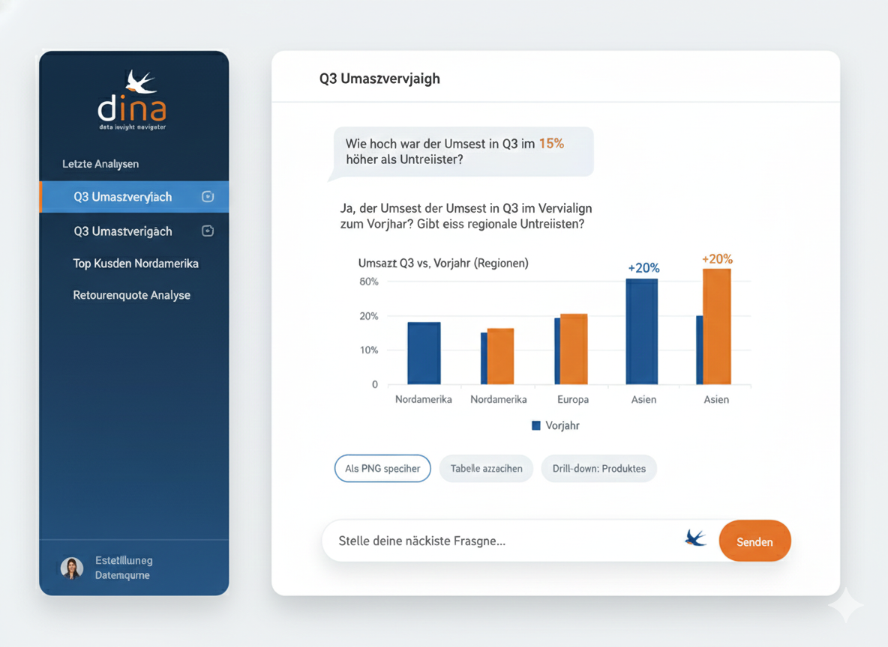

# DINa

Stelle Fragen an einen [Solid](https://solidproject.org/)-Datenraum in
natürlicher Sprache und bekomme Antworten aus den Daten selbst.

DINa übersetzt eine Frage in eine SPARQL-Query, führt sie gegen die Pods aus,
in denen die Daten liegen, und antwortet auf Basis des Ergebnisses. Die Daten
werden dabei nicht kopiert: Die Abfrage läuft im Browser, direkt gegen die
Pods, für die der Nutzer eine Leseberechtigung hat.

*[English version](README.md)*



## Funktionsweise

Eine Frage durchläuft das System so:

```
Browser ──SSE──▶ GET /api/v1/agent/chat
                   │
                   ├─ 1. Plan       der Agent zerlegt die Frage in Schritte
                   ├─ 2. Suche      er durchsucht den DCAT-Katalog des Datenraums
                   ├─ 3. Laden      er lädt die semantischen Modelle der besten Treffer
                   └─ 4. Erzeugen   ein Sprachmodell schreibt die SPARQL-Query
                                    │
                   ◀────────────────┘  Query + Dataset-URLs
Browser ──────▶ Comunica führt die Query gegen die Solid-Pods aus
Browser ──POST─▶ /api/v1/agent/comunica-results
                   │
                   └─ 5. Antwort    der Agent fasst zusammen, rechnet oder visualisiert
```

Daraus folgen zwei Eigenschaften:

- **Das Backend führt selbst kein SPARQL aus.** Es sieht ausschließlich
  Metadaten und die Ergebnisse, die der Browser zurückschickt. Die Daten
  bleiben in den Pods.
- **Die Zugriffskontrolle bleibt bei Solid.** Abfragen laufen mit den
  Zugangsdaten des Nutzers und erreichen genau das, wofür seine WebID
  berechtigt ist.

Die Katalogsuche ist bewusst günstig gehalten: Metadaten zu durchsuchen kostet
nichts, das Laden eines semantischen Modells dagegen einen Netzwerkzugriff.
Der Agent wird deshalb angehalten, erst zu suchen und nur das Nötige zu laden.

## Voraussetzungen

- Docker und Docker Compose
- Ein API-Schlüssel für einen Sprachmodell-Anbieter (DeepSeek, OpenAI oder
  Fireworks) oder eine lokale [Ollama](https://ollama.com/)-Instanz
- Eine WebID auf einem Solid Pod zum Anmelden

## Loslegen

```bash
git clone https://github.com/JakobDch/dina_solid.git
cd dina_solid

cp .env.example .env      # anschließend den API-Schlüssel eintragen
docker compose up --build
```

Die Oberfläche liegt dann unter <http://localhost:3000>, die API unter
<http://localhost:8002> (mit generierter Dokumentation unter `/docs`).

Mit dem Solid Pod anmelden, einen Katalog wählen und eine Frage stellen.

Das Frontend außerhalb von Docker starten:

```bash
cd frontend
npm install
npm run dev
```

## Einen anderen Datenraum anbinden

Zwei Variablen in `.env` bestimmen, welcher Datenraum verwendet wird:

```bash
SOLID_POD_BASE_URL=https://solid-community-server.tmdt.info
DATASPACE_SLUG=dace
```

Alles Weitere wird daraus abgeleitet:

| Abgeleiteter Wert | Zusammensetzung |
|---|---|
| Katalog-Container | `{pod}/{slug}/catalog/ds/` |
| Federation-Registry | `{pod}/semanticdatacatalog/public/{slug}/` |

Ist ein Pod anders aufgebaut, lassen sich `CATALOG_API_URL` und
`FEDERATION_REGISTRY_URL` direkt setzen — sie haben Vorrang.
`SOLID_OIDC_ISSUER` ist bewusst von der Pod-URL getrennt, weil sich Nutzer auch
mit einem anderswo gehosteten Pod anmelden können.

Für ein bereits gebautes Frontend-Image genügt es,
`frontend/public/config.js` zu überschreiben statt neu zu bauen:

```js
window.__DINA_CONFIG__ = {
  DINA_BACKEND_URL: "https://dina-api.example.org",
  SOLID_OIDC_ISSUER: "https://pod.example.org",
};
```

Die Datei wird vor dem Start der Anwendung gelesen; eine andere Fassung in den
Container zu mounten reicht daher aus, um eine Installation umzuhängen.

### Föderation

Die Registry listet alle Pods des Datenraums, und der Agent fragt sie
gemeinsam ab. Nicht erreichbare Pods werden übersprungen, statt die ganze
Anfrage scheitern zu lassen — Registries überleben die eingetragenen Pods
regelmäßig. Mit `CATALOG_USE_FEDERATION=false` wird nur der konfigurierte
Katalog abgefragt.

## Konfiguration

Alle Variablen sind in [`.env.example`](.env.example) dokumentiert. Die
wichtigsten:

| Variable | Zweck |
|---|---|
| `SOLID_POD_BASE_URL` | Pod-Server mit Daten und Katalog |
| `DATASPACE_SLUG` | Pfadsegment, das den Datenraum bezeichnet |
| `SOLID_OIDC_ISSUER` | Identitätsanbieter für die Anmeldung |
| `DEEPSEEK_API_KEY` | Schlüssel für das voreingestellte Sprachmodell |
| `DINA_CORS_ORIGINS` | Erlaubte Browser-Origins für API-Aufrufe |

Das Modell wird pro Unterhaltung in der Oberfläche gewählt; die Profile stehen
in `backend/app/config.py`.

## API-Schlüssel

Der Assistent braucht einen Schlüssel für einen Sprachmodell-Anbieter. Dafür
gibt es zwei Wege; für eine geteilte Instanz ist der erste der bessere:

- **In der Oberfläche.** Über das Schlüssel-Symbol im Header lässt sich ein
  DeepSeek-, OpenAI- oder Fireworks-Schlüssel eintragen. Er bleibt im Browser
  und wird nur mit der Anfrage gesendet, die ihn braucht - der Server
  speichert ihn nie. Jede Person nutzt so ihren eigenen Schlüssel und ihr
  eigenes Kontingent.
- **In der Umgebung.** `DEEPSEEK_API_KEY` (oder `OPENAI_API_KEY` /
  `FIREWORKS_API_KEY`) in `.env` setzen. Für den Einzelbetrieb bequem, aber
  alle Nutzer der Instanz verbrauchen dann denselben Schlüssel.

Ein in der Oberfläche eingetragener Schlüssel hat Vorrang vor der Umgebung.
Lokal über Ollama betriebene Modelle brauchen gar keinen.

## Sprache

Die Oberfläche gibt es auf Deutsch und Englisch. Die Sprache wird aus dem
Browser übernommen und lässt sich im Header umschalten. Antworten richten sich
nach der Sprache der Frage — eine deutsche Frage wird also deutsch beantwortet,
ohne dass etwas eingestellt werden muss.

## Sicherheit

Bitte vor einem öffentlichen Betrieb lesen.

**Diagramme und Berechnungen entstehen durch Ausführen generierten
Python-Codes.** Die bereitgestellten Globals sind eingeschränkt und offenkundige
Ausbruchsversuche werden abgewiesen, aber eine eingeschränkte Globals-Zuordnung
ist in CPython keine Sandbox. Die Funktion ist als Komfort für vertrauenswürdige
Nutzer gedacht. Wer den Dienst weiter öffnet, sollte das Backend isolieren: ein
Container ohne ausgehende Netzwerkverbindung und ohne lohnende Zugangsdaten.

**Die API bringt keine eigene Authentifizierung mit.** Sie setzt voraus, dass
eine davorliegt oder dass sie in einem vertrauenswürdigen Netz steht. Die
Solid-Anmeldedaten dienen ausschließlich dem Lesen der Pods.

Etwas gefunden? Bitte ein Issue eröffnen statt eines Pull Requests.

## Projektstruktur

```
backend/
  app/
    catalog/       DCAT-Katalog-Client, Retrieval-Agent, Modell-Cache
    routers/       HTTP- und SSE-Endpunkte
    orchestrating_agent.py   Planung und Schrittausführung
    sparql_generation.py     Query-Erzeugung und -Bereinigung
frontend/
  src/
    components/    Oberfläche
    hooks/         SSE-Stream, Comunica-Ausführung
    i18n/          Übersetzungen
```

## Mitwirken

Siehe [CONTRIBUTING.md](CONTRIBUTING.md). Fehlerberichte sind willkommen,
besonders zu Datenräumen, die anders aufgebaut sind als der, gegen den
entwickelt wurde.

## Lizenz

[Apache 2.0](LICENSE).

## Förderhinweis

Entwickelt am Lehrstuhl für Technologien und Management der Digitalen
Transformation (TMDT) der Bergischen Universität Wuppertal im Rahmen des
Projekts DACE, gefördert vom Bundesministerium für Forschung, Technologie und
Raumfahrt und der Europäischen Union unter dem Förderkennzeichen 16DKZ2056C.
